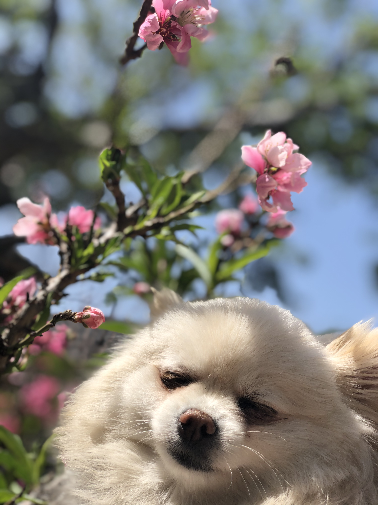

# **Hi, I'm Keli**

## **About me**
I am a fourth year **Bioengineering** student at UCSD. Besides **programming**, I enjoy cooking, traveling, and jornaling in my spare time. 

> **Skills That I Have**

- C++
- Python
- Java
- C
- MATLAB

> **SKills That I Want to Learn**

- [ ] CSS
- [ ] HTML
- [ ] JavaScript

> **I Am Interested In**

`Machine Learning` , `Computer Graphics`, `Computer Vision`, `Computer Animation`

### **My Favor**

1. **Mini** 
   
   
    
    - Mini's Peach
        
        
        
2. **Max** 
   
   

## **How to contact me**

Email: [k3wang@ucsd.edu](k3wang@ucsd.edu)

LinkedIn: [Keli](https://www.linkedin.com/in/keli-wang-90a00a1a3/)

[Top of the page](https://github.com/keli214/UserPage/blob/main/index.md#hi-im-keli)